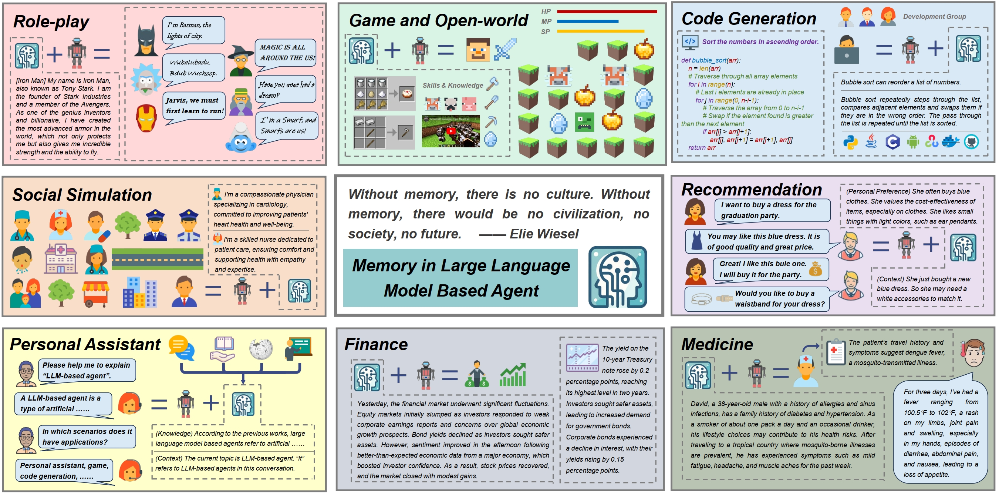
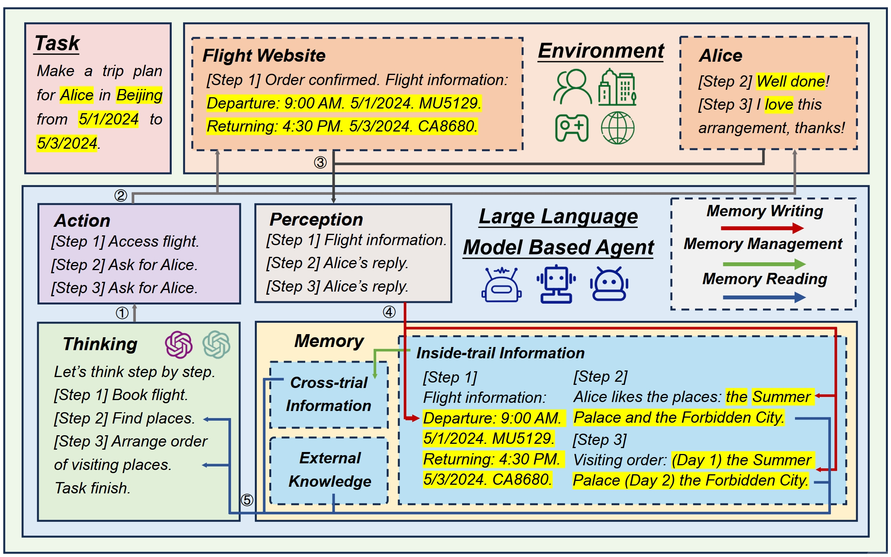
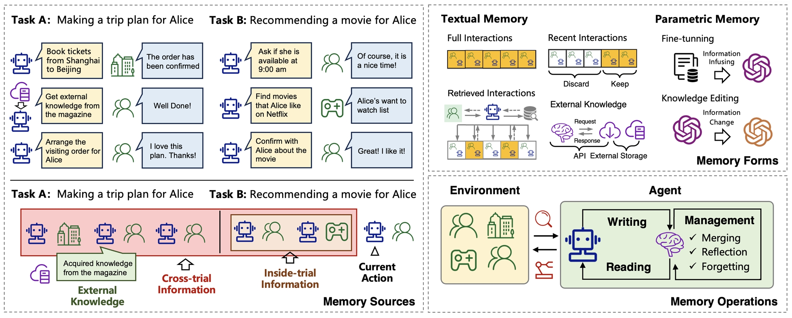
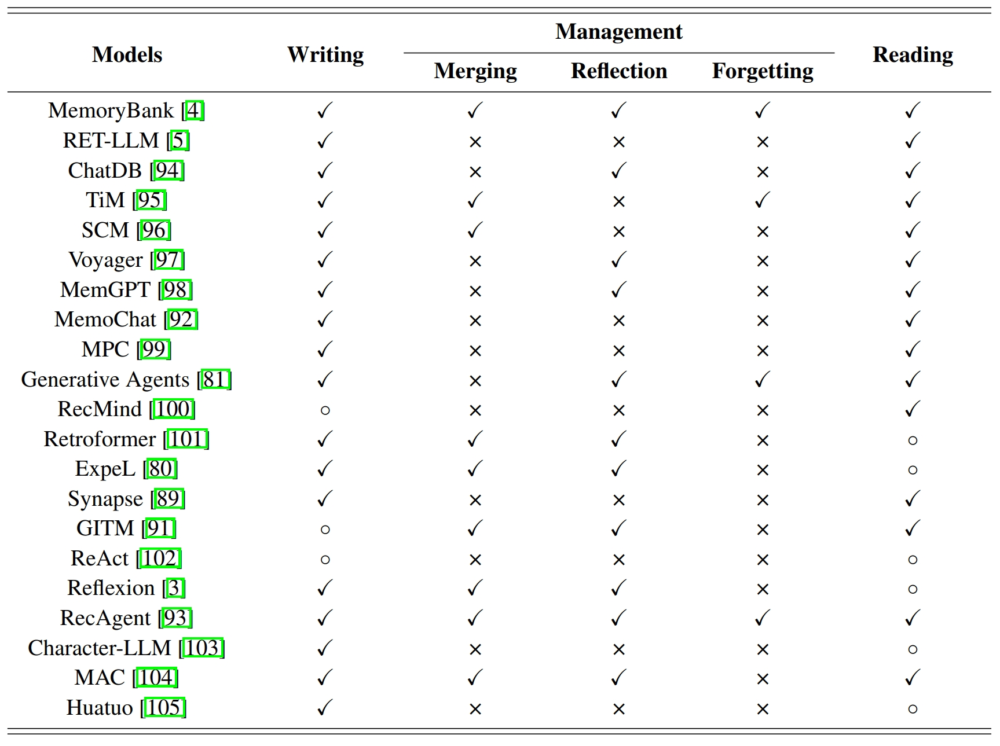
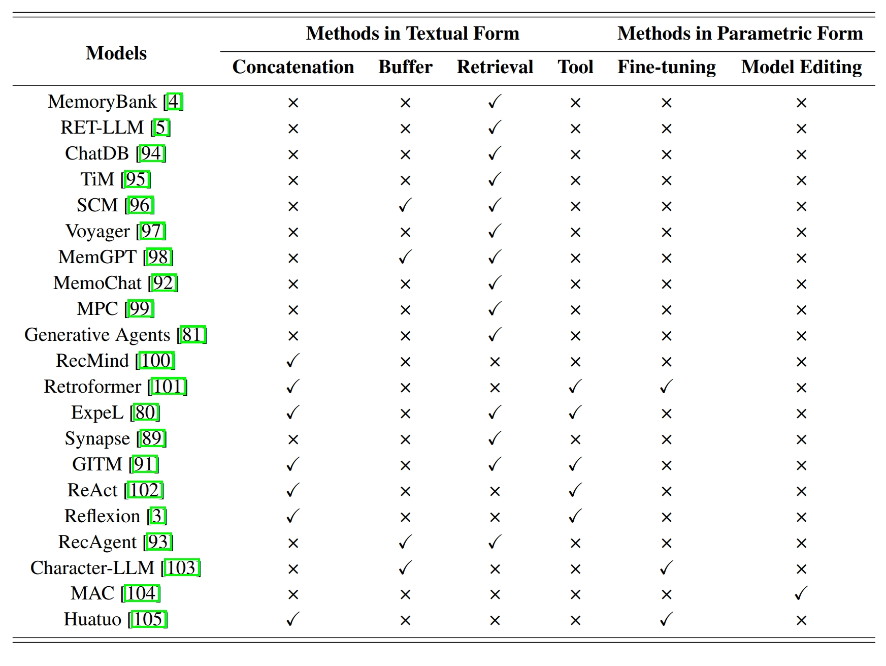
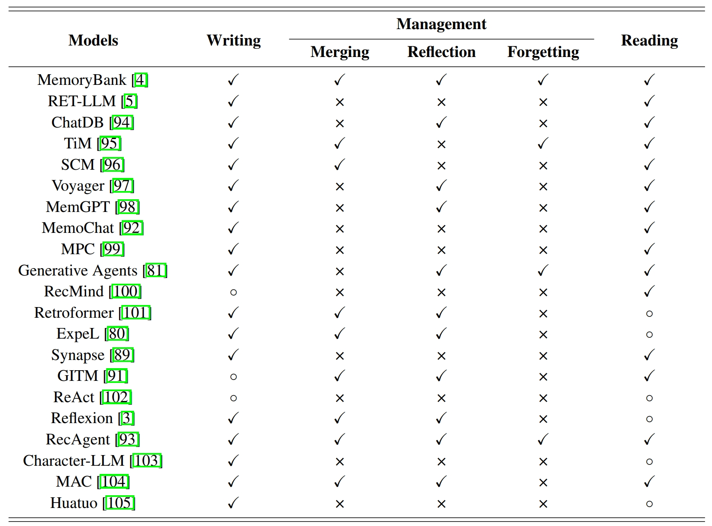
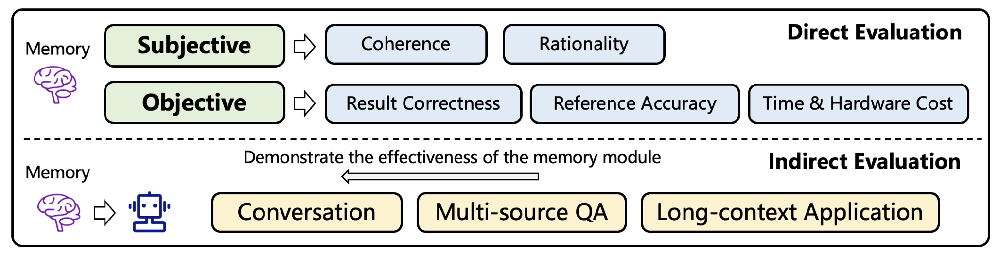
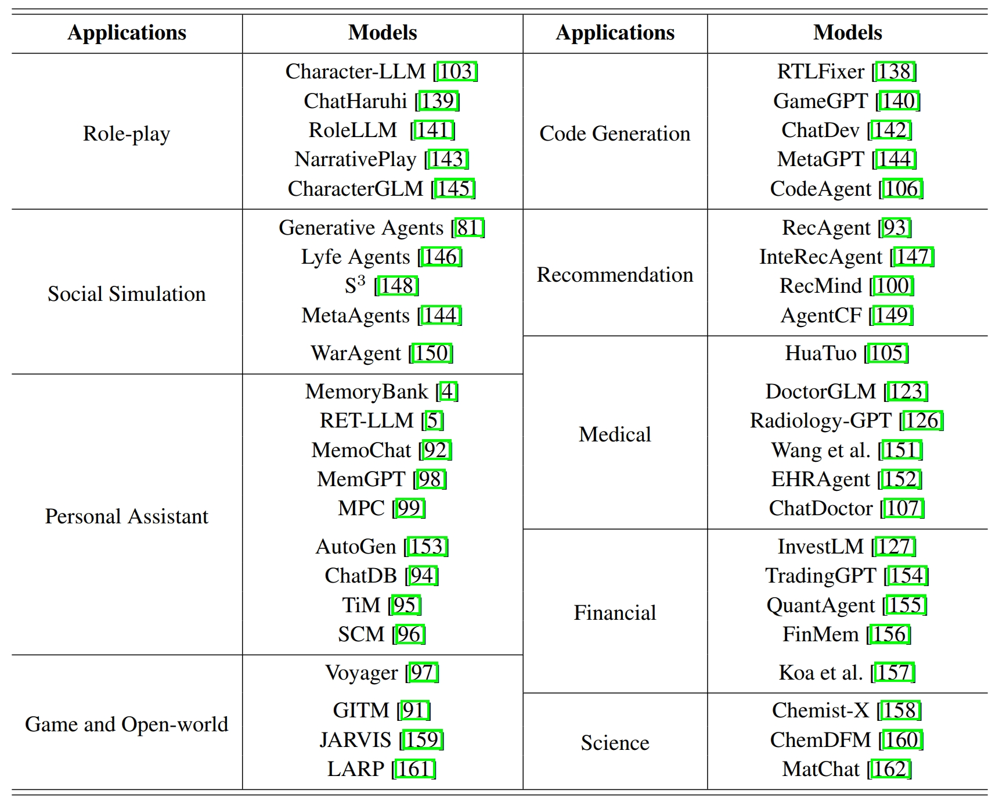

# A Survey on the Memory Mechanism of Large Language Model based Agents

Large language model (LLM) based agents have recently attracted much attention from the research and industry communities. Compared with original LLMs, LLM-based agents are featured in their self-evolving capability, which is the basis for solving real-world problems that need long-term and complex agent-environment interactions. The key component to support agent-environment interactions is the memory of the agents. While previous studies have proposed many promising memory mechanisms, they are scattered in different papers, and there lacks a systematical review to summarize and compare these works from a holistic perspective, failing to abstract common and effective designing patterns for inspiring future studies. To bridge this gap, in this paper, we propose a comprehensive survey on the memory mechanism of LLM-based agents. In specific, we first discuss  ''what is'' and ''why do we need'' the memory in LLM-based agents. Then, we systematically review previous studies on how to design and evaluate the memory module. In addition, we also present many agent applications, where the memory module plays an important role. At last, we analyze the limitations of existing work and show important future directions.

**Paper Link:** 

## 📆 Updates

- [2024/4/21] We release the first version of our survey on arXiv.

## 📋 Table of Contents

- [What is the Memory of LLM-based Agent](#-What-is-the-Memory-of-LLM-based-Agent)
- [Why do We Need Memory in LLM-based Agent](#-Why-We-Need-Memory-in-LLM-based-Agent)
- [How to Implement the Memory of LLM-based Agent](#-How-to-Implement-the-Memory-of-LLM-based-Agent)
- [How to Evaluate the Memory in LLM-based Agent](#-How-to-evaluate-the-memory-in-llm-based-agent)
- [Memory-enhanced Agent Applications](#-memory-enhanced-agent-applications)
- [Citation](#-citation)
- [Acknowledgement](#-acknowledgement)
- [Contact Us](#%EF%B8%8F-Contact-Us)

## 🤖 What is the Memory of LLM-based Agent

## 🤖 Why We Need Memory in LLM-based Agent

### Perspective of Cognitive Psychology

Cognitive psychology is the scientific study of human mental processes such as attention, language use, memory, perception, problem-solving, creativity, and reasoning. Among these processes, memory is widely recognized as an extremely important one. It is fundamental for humans to learn knowledge by accumulating important information and abstracting high-level concepts, form social norms by remembering cultural values and individual experiences, take reasonable behaviors by imagining the potential positive and negative consequences, and among others. A major goal of LLM-based agents is to replace humans for accomplishing different tasks. To make agents behave like humans, following human's working mechanisms to design the agents is a natural and essential choice. Since memory is important for humans, designing memory modules is also significant for the agents. In addition, cognitive psychology has been studied for a long time.  Many effective human memory theories and architectures have been accumulated, which can support more advanced capabilities of the agents. 

### Perspective of Self-Evolution

To accomplish different practical tasks, agents have to self-evolve in dynamic environments. In the agent-environment interaction process, the memory is key to the following aspects:
**(1) Experience accumulation.**
An important function of the memory is to remember past error plannings, inappropriate behaviors, or failed experiences, so as to make the agent more effective for handling similar tasks in the future. This is extremely important for enhancing the learning efficiency of the agent in the self-evolving process.
**(2) Environment exploration.** 
To autonomously evolve in the environment, the agents have to explore different actions and learn from the feedback. By remembering historical information, the memory can help to better decide when and how to make explorations, for example, focusing more on previously failed trials or actions with lower exploring frequencies.
**(3) Knowledge abstraction.**
Another important function of the memory is to summarize and abstract high-level information from raw observations, which is the basis for the agent to be more adaptive and generalizable to unseen environments. In summary, self-evolution is the basic characteristic of LLM-based agents, and memory is of key importance to self-evolution.

### Perspective of Agent Applications

In many applications, memory is an indispensable component of the agent. For example, in a conversational agent, the memory stores information about historical conversations, which is necessary for the agent to take the next actions. Without memory, the agent does not know the context, and cannot continue the conversation. In a simulation agent, memory is of great importance to make the agent consistently follow the role profiles. Without memory, the agent may easily step out of the role during the simulation process. Both of the above examples show that the memory is not an optional component, but is necessary for the agents to accomplish given tasks.

In the above three perspectives, the first one reveals that the memory builds the cognitive basis of the agent. The second and third ones show that the memory is necessary for the agent's evolving principles and applications, which provide insights for designing agents with memory mechanism. 

## 🤖 How to Implement the Memory of LLM-based Agent

### Memory Sources

### Memory Forms

### Memory Operations

## 🤖 How to Evaluate the Memory in LLM-based Agent

## 🤖 Memory-enhanced Agent Applications

## 🔗 Citation

To be determined.

## ☕ Acknowledgement

We thank Lei Wang for his proofreading and valuable suggestions to this survey.

## ✉️ Contact Us

If you have any questions or suggestions, please feel free to contact us via:

Email: zeyuzhang@ruc.edu.cn and xu.chen@ruc.edu.cn
